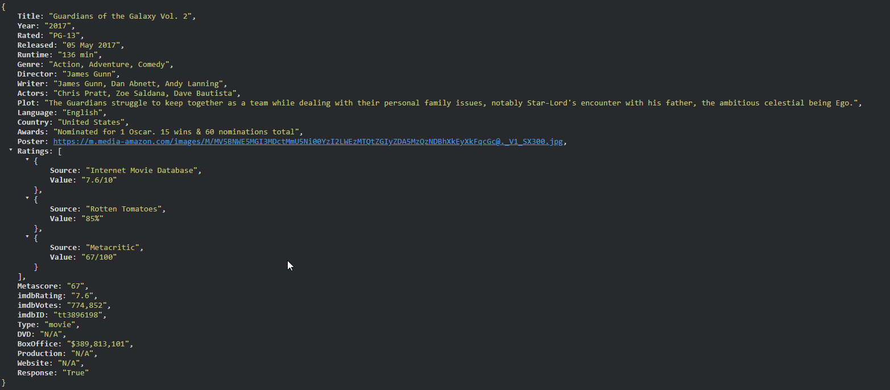

# Overview/Misson For Project

_This project will be very basic to complete the goals required of me but will be expanding upon as I decided to add features and update styling as my skillset progresses_

- Will be basic in terms of search parameters primarily
- Functionality wise it will not need much
  - A navbar consisting of
    - Watchlist
    - Top Rated Page
    - Search Page
    - Login (which becomes logout if the user is logged in)
  - Logo Which will be in the top left across from the navigation panel
  - Title/Header as a greeting to user
  - Sub-title/Paragraph tag under the the header that invites the user to search the database for a movie
  - A Search Input
  - A Section for search results
  - Footer with possibly a back to top button depending on styling of each movie card and how much of the page it takes styling wise (this may also be added later when we are not limiting our search results to 6 per directions)

# Writing my questions

- ~~Which API will I use?~~
  - ~~How do I get access?~~
  - ~~What will be my API key?~~
  - ~~What kind of data is stored about each movie?~~
  - What parts of this data will I actually render to the user's search results?
- ~~What are the goals of my project vision wise?~~
- What will be required in the HTML structure?
- ~~How many pages will I have?~~
  - ~~What will be the purpose of each page?~~
- ~~How do I create variables in CSS?~~
- ~~What kind of search will I be using?~~
  - ~~By year?~~
  - ~~By genre?~~
  - ~~By Title?~~
  - ~~By a toggle like David's mock up to search within a given set of years set by the user? Should I do this in number form?~~
  - ~~What is even available as the search methods for the API I will be using from their documentation?~~
- ~~Will I need to use local storage for any persistent data that I can think of at the moment?~~
- ~~What kind of websites will I use for visualizing functionality and UX?~~
- ~~How do I link icons so I can use them within my HTML?~~
- ~~What kind of typography should I employ?~~

# Answers to questions

- I will be employing the [OMDb API](https://www.omdbapi.com/), which is an open movie database

  - I have gained access by creating an account and sending a request to their free API Key form
  - I have verified the key as working
  - An example of the database break down of data available for a movie is:
    
  - My API Key will be entered into the project to try and protect it slightly.
  - Due to the vast amount of information that is provided regarding each movie object I will only render
    - Title
    - Year
    - Runtime
    - Director
    - Actors
    - imdbRating
    - Box Office Earnings
    - Although I may be rendering all of this I will only create a search for certain pieces of it.

- The goals of my project have been stated in the project overview above but to reiterate here are some of the elements I will include(subject to change)
  - Navbar (with watchlist, top rated, Search, Signin/Signout)
  - The homepage will have a search input at the center of the page
  - Underneath the search input I will have the search results render
  - A page for top rated movies overall (first 6-10)
  - A page for each movie when the user clicks on it
  - Footer with a back to top button (if the results seem to push user much lower on website)
- Pages
  - Homepage (will contain search input, search results, navbar, footer)
  - Top rated Movies Page
  - A movie page for specifically the one the user selects.
- HTML Structure
  - Homepage will need
    - logo and navbar across from it
    - Title
    - Subtitle Paragraph
    - Search Input
    - Search Results Container
    - Footer
  - Top Rated Movies
    - A container that will house the top rated movies overall
  - Movie Page
    - This page is intended to be the movie page for a selected movie from a user when they click on a movie card from their search results
      - The user will navigated to the `movie-details` page which will dynamically fetch data and transition rendering on this page accordingly
    - The details to be rendered are already listed above
    - Will also add a back to home page button
- Search Engine
  - For now my search functionality will be limited to just searching my 'title' (later I may come back to this project to further add features and functionality)
- Local Storage
  - For now the main thing I can anticipate needing local storage for will be to hold the IMDB movie id which will be needed for when a user clicks on a movie card and enters that specific movies page for a more expanded view
- Inspiration Websites
  - David's Mockup for the project [Car Search](https://dev.d24jig8s1lr7n9.amplifyapp.com/)
  - [IMDB](https://www.imdb.com/)
  - [Graham's Terror Machine](https://capstone-terror-time-machine-client.vercel.app/)
- Linking Icons
  - I will plug in a "FontAwesome Kit" with a code that I will include in `index.html` to enable the use of icons within this project
- Typography
  - I will use Kanit for the titles
  - Roboto for the main text
- CSS Variables
  - Per W3 Schools Variables are initialized within the ::root selector and then later can be invoked within CSS declarations with the var(--variableNameHere) syntax

# Make A Plan

### Phases Overview

- Phase 1
  - ~~Set up folder structure, basic HTML pages~~, and basic CSS layout styling
  - Fetch and render data using OMDb API with a static search term to test
- Phase 2
  - Create `index.html` with a functional search with placeholder for search results
  - Build `top-rated.html` with a container to render dummy cards for testing layout
  - Develop `movie-details.html` with a placeholder layout for the expanded view layout when a user selects a movie
- Phase 3
  - Implement search functionality linked to OMDb with search input from user on homepage
  - Dynamically load "Top Rated" movies and render movies cards on `top-rated.html`
  - Also enable these to be a simliar movie card so that when the user clicks on these cards they are navigated to `movie-details.html` with data passed through local storage
- Phase 4
  - Declare CSS variables to create consistent themes/styles throughout all webpages
  - Add responsive design for mobile/tablet screens
  - Ensure typography is working correctly through elements
    - Kanit for titles
    - Roboto for rest
- Phase 5 (Beyond MVP - MVP Is until phase 3)
  - Add 'Add to watchlist' page where user can remove/add movies utilizing local storage since this project is written in vanilla JS
  - Explore concept of adding more results being displayed to the search results for user along with adding pages to limit results per page
  - Enhance search functionality to include genre, title, year, or even actors

---

## `index.html`

### Purpose

The homepage will be the primary hub for the user to search movies. I will try to keep it simple and clean with a focus on the search bar and rendering the search results. Along with the navigation bar and logo along the top of the web application.

### Features

- **Search Input** - A form with a single search field and submit button
- **Search Results Container** - Container where the movie cards will render when a user searches
- **Navigation Bar** - Links to Top Rated, Watchlist, Signin/Signout
- **Footer** - Additional Information, copyright, and back-to-top button(possibly)

### HTML Structuring

- Logo/Brand with nav bar on opposite side with
  - Top Rated
  - Watchlist
  - Signin/Signout
- Search Form with input and submit button
- Section for rendering search results
- Footer, copyright, some navigation, and back-to-top button

### `index.js`

- Handle form submission
- Fetch search results from OMDb API using movie title entered by user
- Dynamically generate and render movie cards in the search results container on index.html

## `movie-details.html`

### Purpose

This page will provided expanded details about a movie when a user clicks on a movie card

### Features

- Back button to return to the homepage
- Display
  - Movie Poster/Cover
  - Title
  - Year
  - Genre
  - Director
  - Cast
  - Plot
  - IMDb rating
  - Box Office info

### HTML Structure

- Test with placeholder details will need to render each of the above elements
- Include a back button for user to navigate back to homepage with search
  - Decide if keeping the search term in local storage or just a complete reset for UX

### `movie-details.js`

- Fetch movie data using the OMDb API by `IMDbID` stored in `local storage`
- Populate page with selected movie data
- Handle navigation back to previous page

## `top-rated.html`

### Purpose

This page will show a list of the top rated movies based on overall rating within OMDb

### Features

- Layout with either flexbox or grid to display top 10 movie cards
- Each card links to it's own movie-details page
- Include navbar and footer

### HTML Structure

- Container that will hold the entire movie details
- Within this container 2 children
  - The first child will be the movie poster image
  - The second child will be a container that holds all the information about the movie
  - Handle navigation back to previous page

### `top-rated.js`

- Fetch top-rated movies (if API allows) or use hardcoded data
- Render movies into top-rated movies container
- Set up functionality to ensure each movie card links to the appropriate `movies-details.html` with the correct `IMDbID`
- For this page We may need to switch to the [The Movie Database](https://developer.themoviedb.org/reference/movie-top-rated-list), which has an endpoint dedicated to listing movies directly by top rating which is not available as a search parameter in the OMDb API
  - We will cross this bridge when we get to building this page & script
  - I have already created an account and requested an API KEY from TMDB just in case I need this API down the line of developing this project
